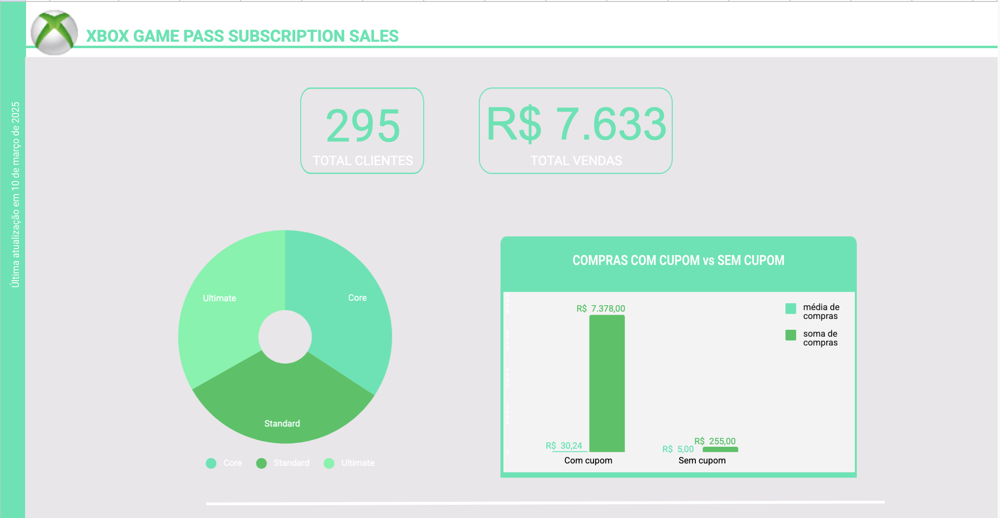

# Criando-um-Dashboard-de-Vendas-com-Excel
O objetivo é transformar dados brutos em informações visuais claras e úteis, permitindo uma análise eficaz do desempenho de vendas e a tomada de decisões baseadas em dados.

## INÍCIO
A primeira etapa do dashboard foi entender o que gostaria de responder. Então, indiquei os campos da tabela ao agente de IA criado no Gemini e pedi que ele formulasse três questões de negócio e uma situation problem. A resposta foi a seguinte:

"Imagine que você foi contratado como Analista de Dados por uma grande plataforma de jogos (tipo uma Xbox Game Pass ou PS Plus). O seu Diretor de Operações precisa decidir onde investir o orçamento de marketing do próximo trimestre e como reduzir a perda de clientes.

Para guiar seu dashboard, aqui estão as 3 perguntas de negócio estratégicas:

1. Qual é a saúde do faturamento recorrente (MRR) vs. Vendas Avulsas?
2. O uso de cupons está gerando lucro ou apenas "canibalizando" a receita?
3. Qual é o Lifetime Value (LTV) médio por tipo de plano?

## Questão de negócio 1: Qual é a saúde do faturamento recorrente vs vendas avulsas?
Inicialmente, limpei os dados de todas as colunas numéricas, para excluir o símbolo monetário R$ incluído como texto. Para isso, fiz o seguinte: 

- Localizar R$ nas colunas de preços;
- Substituir por espaço em branco nas respectivas colunas;
- Substituir tudo.

Depois, converti em moeda para efetuar os cálculos a seguir: 

1. Criar a coluna de Faturamento Recorrente
Fórmula: =[célula correspondente à coluna Subscription Price] 

2. Criar a coluna de Vendas Avulsas
Fórmula: soma da célula correspondente à coluna EA Play Season Pass Price e célula correspondente à coluna Minecraft Season Pass Price

Para gerar o gráfico, criei a tabela dinâmica:
> - Linha e filtro: Subscription type
> - Valores: SUM de Faturamento_Recorrente; SUM de Vendas_Avulsas 
> - Exibição dos valores como % do total da coluna

Logo em seguida, criei um controle de filtros:
> Dados > Adicionar controle de filtros 

## Questão de negócio 2: O uso de cupons está gerando lucros ou apenas canibalizando a receita?
Criei uma coluna "Uso de cupom", com a fórmula "IF(célula da coluna Coupon Value)>0;"Sim"; "Não")" para classificar as vendas em dois grupos distintos.

Já na tabela dinâmica, coloquei a coluna "Uso de cupom" na linha, e arrastei duas vezes a coluna "Total value" para os Valores: uma, com a soma; outra, com a média.
  > Aqui, a ideia é entender o gasto de quem entra sem e com cupom, e assim dimensionar a influência dessa estratégia nas vendas.

No gráfico, exclui as linhas horizontais, pintei de branco o eixo y, para dar destaque apenas à proporção do gasto do uso de cupom.

## Questão de negócio 3: Qual o lifetime value médio por tipo de plano? 

- Criei uma tabela dinâmica com "Subscription Type" na linha e "Total Value" nos valores;
- Mudei o "Total Value" de SOMA para MÉDIA, para saber quanto um cliente de cada plano vale em média, obtendo assim a qualidade do cliente; 
- Incluí a coluna "Auto Renewal" para aprofundar a qualidade do cliente de cada plano e assim direcionar ações para cada grupo, se for o caso. 

No gráfico, fiz o mesmo procedimento estilístico do anterior, para priorizar a visualização por tipo de assinatura. Inclusive, os gráficos 1 e 3 são dividem o mesmo controle de filtro.

## RESULTADO
1. **Versão Interativa (Google Sheets):** [Clique aqui para acessar o Dashboard Online](https://docs.google.com/spreadsheets/d/1JXF7humhDV2_EoVjQCxIXaccBEhqmaEyr8Ve87H9V7A/edit?gid=1765700558#gid=1765700558)
2. **Arquivo Bruto (Excel):** [Baixar arquivo .xlsx](https://github.com/esteladados12/Criando-um-Dashboard-de-Vendas-com-Excel/dashboard_xbox_gamepass_subscription_salesDIO.xlsx)

